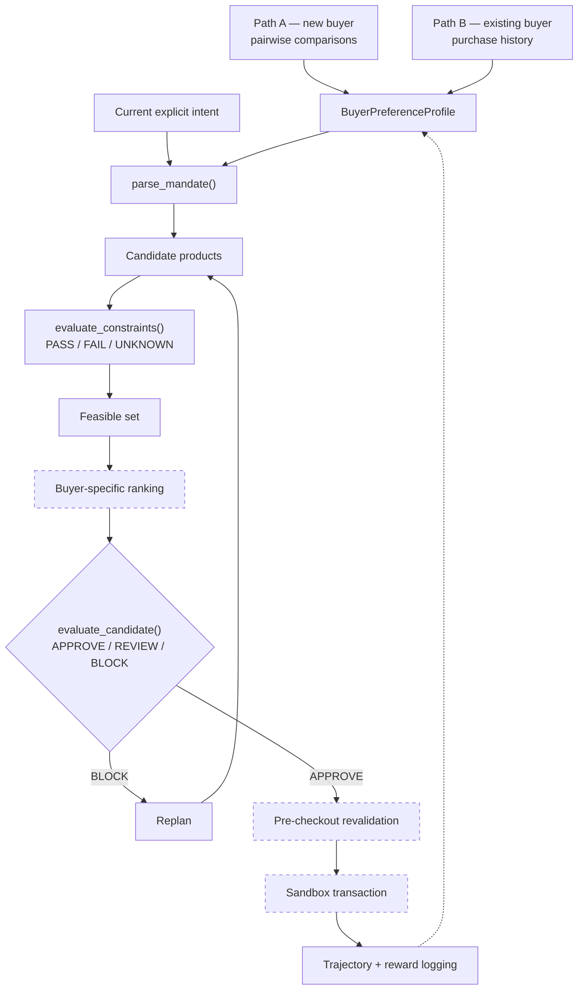

# MandateLab

**The buyer-alignment and authorization layer for agents that spend money.**

MandateLab learns what "best" means for an individual buyer, converts a purchase
request into an explicit mandate, and lets a commerce agent find and execute the
best *permissible* purchase. "Best deal" is not the cheapest product — it is the
best buyer-specific trade-off across price, quality, brand, delivery, condition,
returns and merchant trust.

Two responsibilities stay separate by design:

- **Commerce execution** — finding and attempting to buy a product.
- **Mandate authorization** — independently deciding whether that transaction is permissible.

The executor must never bypass the Decision Engine.

> Same products. Different buyer. Different best decision. Same mandate discipline.

Full spec: [`docs/mandatelab-mvp-prd.md`](docs/mandatelab-mvp-prd.md)

---

## Status

| PRD | Component | Owner | State |
|---|---|---|---|
| §6 | Shared data contracts | Prathmesh | ✅ `contracts/` — Pydantic models, `schema_version 1.0` |
| §5.1 | Cold-start pairwise learning | Luke | ✅ `user_profile/` — Python core + React swipe UI |
| §5.2 | Existing-buyer learning | Sasa | ✅ `buyer_history/` — profiles, prediction, versioned updates, trajectories |
| §5.3 | Intent → mandate conversion | Prathmesh | ✅ `parse_mandate()` |
| §5.3 | Hard-constraint evaluation | Prathmesh | ✅ `evaluate_constraints()` — PASS / FAIL / UNKNOWN |
| §5.3 | APPROVE / REVIEW / BLOCK | Prathmesh | ✅ `evaluate_candidate()` |
| §5.3 | Buyer-specific ranking | — | ❌ `RankingExplanation` modelled, nothing implements it |
| §5.4 | Executor + pre-checkout revalidation | Prathmesh | ❌ not started |
| §5.5 | Replanning | Prathmesh | ⚠️ `ReplanInstruction` emitted on BLOCK; no loop consumes it |
| §7 | Trajectory / reward logging | Sasa | ✅ `buyer_history.events` |
| §8 | Controlled product catalog | Shared | ❌ no shared fixture yet |

Both preference paths produce the shared profile, and a mandate can be built and
authorized end to end. What is missing is **ranking** — deciding which of several
*permissible* candidates best suits this buyer — plus the executor that carries a
decision through to a sandbox purchase.

Tests: **79 passing** across four packages.

---

## Layout

```
contracts/        mandatelab_contracts  — shared schemas, the integration seam
mandate_engine/   mandatelab_engine     — mandates, constraints, decisions
buyer_history/    buyer_history         — §5.2 learning from purchase history
user_profile/     user_profile          — §5.1 cold-start pairwise comparisons
  frontend/       React + Vite swipe UI for the comparison flow
docs/             the PRD
```

---

## Quick start

Python 3.11, [uv](https://docs.astral.sh/uv/) for the workspace.

```bash
uv sync                 # all four packages
uv run pytest           # 79 tests across every module
```

Demos:

```bash
python3 buyer_history/examples/demo.py   # profile → prediction → update → trajectory
python3 user_profile/examples/demo.py    # Pareto set + ranked feed per buyer
```

`buyer_history` is stdlib-only, so it also runs with no install at all:

```bash
python3 buyer_history/tests/test_buyer_history.py   # 40 checks, no pytest needed
```

The comparison UI:

```bash
cd user_profile/frontend && npm install && npm run dev
```

---

## The pipeline



Dashed nodes are not yet implemented.

Preference precedence, highest first:

1. Current hard mandate
2. Current explicit preferences
3. Learned category preferences
4. General buyer preferences
5. Default assumptions

---

## The modules

### `contracts/` — the integration seam

Pydantic models every other module speaks: `BuyerPreferenceProfile`, `Mandate`,
`TransactionCandidate`, `CartSnapshot`, `DecisionResult`, plus the enums carrying
decision semantics — `Decision` (APPROVE / REVIEW / BLOCK), `ConstraintStatus`
(PASS / FAIL / UNKNOWN), `PreferenceSource`.

`PreferenceProfileBuilder` is the protocol both learning paths implement, so
cold-start and history-derived profiles are interchangeable downstream:

```python
class PreferenceProfileBuilder(Protocol[ProfileInputT]):
    def build_profile(self, source: ProfileInputT, /) -> BuyerPreferenceProfile: ...
```

`PreferenceSource` reserves `COLD_START`, `CATEGORY_HISTORY` and
`GENERAL_HISTORY`, so every profile records which path produced it and at what
scope.

### `mandate_engine/` — mandates, constraints, decisions

Deterministic code, never an LLM, decides policy compliance.

```python
from mandatelab_engine import parse_mandate, evaluate_constraints, evaluate_candidate

mandate  = parse_mandate(intent, profile)      # precedence + fallback handling
decision = evaluate_candidate(candidate, mandate)  # APPROVE / REVIEW / BLOCK
```

Every constraint returns PASS, FAIL or **UNKNOWN**, and a candidate joins the
feasible set only when all of them PASS — unverifiable data cannot slip through.
Natural-language extraction stays outside this boundary by design.

Details: [`mandate_engine/README.md`](mandate_engine/README.md)

### `buyer_history/` — learning from what the buyer already bought

Normalises multi-channel transaction history into one schema, infers per-item and
per-category preferences with evidence weighting, and predicts purchase
likelihood through an additive log-odds model whose every driver is named and
explained. New purchases and feedback produce a new profile version; nothing is
retrained.

Two invariants: purchase history is **evidence, not ground truth** (current
explicit intent outranks it), and behaviour **never emits a hard mandate** —
`hard_rule_candidates` is always empty, because only the cold-start path may
propose candidate hard rules.

Attributes the data cannot speak to — condition, return policy, delivery — are
emitted as `ImportanceLevel.UNKNOWN` with confidence 0, never as a guessed level.

```python
from buyer_history import build_profile_from_workbook
from buyer_history.contract import PurchaseHistoryProfileBuilder

bundle  = build_profile_from_workbook("…​.xlsx")
profile = PurchaseHistoryProfileBuilder("Groceries > Coffee").build_profile(bundle)
```

`buyer_history.contract` is the only part needing Pydantic, so it ships as an
opt-in extra and the core stays dependency-free.

Details: [`buyer_history/README.md`](buyer_history/README.md)

### `user_profile/` — cold start from pairwise comparisons

For buyers with no history. A React swipe deck presents product pairs exposing
real trade-offs (price vs quality, brand vs price, new vs refurbished), and the
Python core turns the answers into preference weights and a Pareto-filtered feed.
A strict prohibition such as "never refurbished" should become a
`HardRuleCandidate` with `requires_confirmation=True` rather than a silent
ranking preference.

---

## Known gaps

**No buyer-specific ranking.** This is the critical path.
`evaluate_candidate()` decides whether a transaction is *permissible*; nothing
decides which permissible candidate is *best for this buyer*.
`RankingExplanation` is modelled but unimplemented.
`buyer_history.predict_purchase_probability()` already returns a scored,
fully-explained ordering and is the natural supplier.

**No executor.** No sandbox cart, no pre-checkout revalidation. PRD §5.4 is
untouched, so an APPROVE currently leads nowhere.

**Replanning is half-wired.** `evaluate_candidate()` emits `ReplanInstruction`
on BLOCK, but no loop consumes it to search again.

**No shared catalog.** `user_profile/examples/products.csv` holds 12 products and
`buyer_history` carries its own synthetic ledger. §8 calls for one normalised
catalog both paths agree on.

**Cold start does not emit the contract.** `buyer_history` implements
`PreferenceProfileBuilder`; `user_profile` still returns its internal `User` and
`UserPreferences`. Mirroring [`buyer_history/src/buyer_history/contract.py`](buyer_history/src/buyer_history/contract.py)
would close it — and `parse_mandate()` already requires a shared profile, so
Path A cannot reach the engine until it does.

**`category = "*"` is a convention.** The contract requires a non-empty
`category`, so the buyer-wide profile uses `"*"` and carries its real scope in
`PreferenceSource.GENERAL_HISTORY`. Works, but the schema does not enforce it.

---

## Data and privacy

**This repository is public and contains no real purchase data.**

`buyer_history` runs on a synthetic fixture with an invented buyer, orders, dates
and prices. Real household data lives in a gitignored `transaction data/`
directory, and profiles derived from it are gitignored too — derived output
carries the same detail as its input.

Before adding any data source, confirm it is synthetic or gitignore it first.
