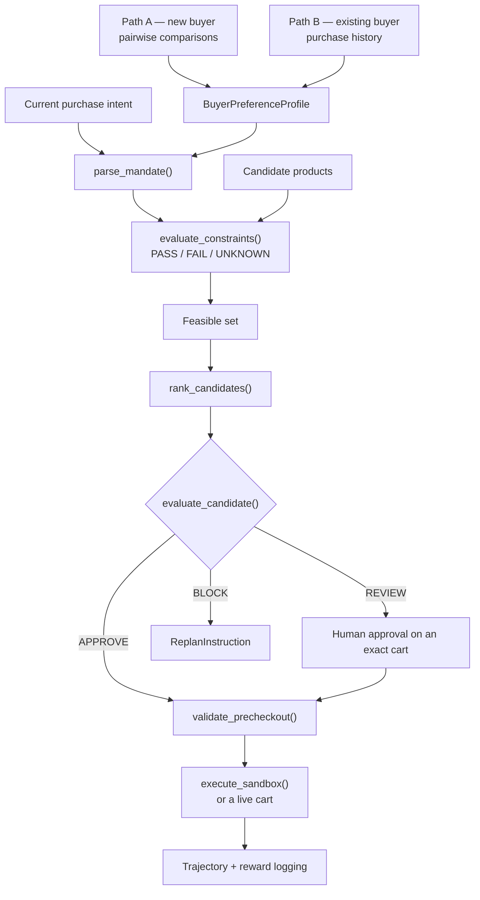

# MandateLab

**The buyer-alignment and authorization layer for agents that spend money.**

MandateLab learns what "best" means for an individual buyer, converts a purchase
request into an explicit mandate, and lets a commerce agent act only within it.
"Best deal" is not the cheapest product — it is the best buyer-specific
trade-off across price, quality, brand, delivery, condition, returns and
merchant trust.

Two responsibilities stay separate by design:

- **Commerce execution** — finding and attempting to buy a product.
- **Mandate authorization** — independently deciding whether that transaction is permissible.

The executor never bypasses the Decision Engine.

> Same products. Different buyer. Different best decision. Same mandate discipline.

Full spec: [`docs/mandatelab-mvp-prd.md`](docs/mandatelab-mvp-prd.md)

---

## What it does

A buyer arrives by one of two paths — swiping through product comparisons, or
handing over their purchase history. Both produce the same
`BuyerPreferenceProfile`. That profile plus a current request becomes an
explicit **mandate**: hard constraints, soft preferences, and spending
authority. Candidates are checked against it deterministically, ranked for this
buyer, revalidated immediately before checkout, and only then executed.



Preference precedence, highest first:

1. Current hard mandate
2. Current explicit preferences
3. Learned category preferences
4. General buyer preferences
5. Default assumptions

---

## Layout

```
contracts/         mandatelab_contracts        shared schemas, the integration seam
mandate_engine/    mandatelab_engine           mandates, constraints, ranking, decisions
sandbox_executor/  mandatelab_sandbox_executor guarded simulated execution
weee_cart/         mandatelab_weee_cart        guarded execution against a live store
buyer_history/     buyer_history               preference learning from purchase history
user_profile/      user_profile                cold-start learning from pairwise comparisons
  frontend/        React + Vite comparison UI
api/               mandatelab_api              the workflow over HTTP
examples/          mvp_demo.py                 the whole flow, end to end
docs/              the PRD
```

---

## Quick start

Python 3.11, [uv](https://docs.astral.sh/uv/) for the workspace.

```bash
uv sync
uv run pytest
uv run python examples/mvp_demo.py      # the deterministic end-to-end flow
```

The HTTP API:

```bash
uv run uvicorn mandatelab_api:app --reload      # docs at /docs
```

The comparison UI (cold start):

```bash
cd user_profile/frontend && npm install && npm run dev
```

The weekly basket UI (purchase history → a real cart):

```bash
python buyer_history/examples/weekly_basket_app.py      # http://127.0.0.1:8765
```

`buyer_history` is stdlib-only, so its core also runs with no install at all:

```bash
python3 buyer_history/tests/test_buyer_history.py       # 40 checks, no pytest needed
```

---

## `contracts/` — the integration seam

Pydantic models every other package speaks: `BuyerPreferenceProfile`,
`Mandate`, `PurchaseIntent`, `TransactionCandidate`, `CartSnapshot`,
`HumanApproval`, `DecisionResult`, `ReplanInstruction`, plus the enums carrying
decision semantics — `Decision` (APPROVE / REVIEW / BLOCK), `ConstraintStatus`
(PASS / FAIL / UNKNOWN), `PreferenceSource`, `ImportanceLevel`.

`PreferenceProfileBuilder` is the protocol both learning paths implement, so
cold-start and history-derived profiles are interchangeable downstream:

```python
class PreferenceProfileBuilder(Protocol[ProfileInputT]):
    def build_profile(self, source: ProfileInputT, /) -> BuyerPreferenceProfile: ...
```

Every preference value carries a `source` and a `confidence`, so consumers can
tell a stated requirement from an inferred habit. `PreferenceSource`
distinguishes `CURRENT_EXPLICIT`, `COLD_START`, `CATEGORY_HISTORY`,
`GENERAL_HISTORY` and `DEFAULT`.

`HardRuleCandidate` carries a proposed hard rule — "never refurbished" — with
`requires_confirmation=True`, so a prohibition inferred during onboarding must
be confirmed before it can block a purchase.

---

## `mandate_engine/` — mandates, constraints, ranking, decisions

Deterministic code, never an LLM, decides policy compliance. Natural-language
extraction stays outside this boundary by design.

```python
from mandatelab_engine import (
    parse_mandate,          # (intent, profile)          -> Mandate
    evaluate_constraints,   # (candidate, constraints)   -> [ConstraintResult]
    is_feasible,            # all PASS?
    rank_candidates,        # (candidates, mandate, profile) -> [RankedCandidate]
    evaluate_candidate,     # (candidate, mandate)       -> DecisionResult
    validate_precheckout,   # (cart, mandate, approval)  -> DecisionResult
)
```

Every constraint returns PASS, **FAIL** or **UNKNOWN**, and a candidate joins
the feasible set only when all of them PASS — unverifiable data cannot slip
through as permission.

`rank_candidates` orders the feasible set by buyer-specific weighting, which is
what separates *permissible* from *best for this buyer*. `evaluate_candidate`
returns APPROVE, REVIEW or BLOCK with named reason codes
(`AUTONOMOUS_SPEND_LIMIT_EXCEEDED`, `FINAL_LANDED_PRICE_UNKNOWN`,
`MATERIAL_AMBIGUITY`, …), and on BLOCK emits a `ReplanInstruction` describing
the constraint to search under next.

`validate_precheckout` re-runs the decision against the final cart. Human
approval binds to an exact cart snapshot, so a change to product, variant,
price, condition, merchant or delivery invalidates it.

Details: [`mandate_engine/README.md`](mandate_engine/README.md)

---

## `api/` — the workflow over HTTP

FastAPI, mounted under `/api/v1`, mirroring the engine one-for-one:

| Method | Path | |
|---|---|---|
| GET | `/health` | liveness |
| POST | `/mandates` | intent + profile → `Mandate` |
| POST | `/rankings` | candidates → ranked, buyer-specific |
| POST | `/decisions` | candidate → APPROVE / REVIEW / BLOCK |
| POST | `/precheckout` | final cart → revalidated decision |
| POST | `/sandbox/execute` | approved cart → `TransactionOutcome` |

---

## Execution

Two executors, both separate from the Decision Engine and both re-checking the
decision rather than trusting it.

**`sandbox_executor/`** — simulated. `execute_sandbox(cart, decision)` refuses
with a named code when the decision is not APPROVE, still carries violations,
was issued for a different cart or candidate, leaves a REVIEW unresolved, has
already run, or is timestamped ahead of execution. The cart fingerprint check
is what makes approval non-transferable between carts.

**`weee_cart/`** — a live grocery cart. Basket lines are gated through
`parse_mandate` → `evaluate_candidate` before the browser sees them; only
APPROVE is acted on. It drives a Chrome it owns with a persistent profile, so
the buyer signs in once and no credential passes through the code. Quantity is
*set*, not incremented — it reads the tile's current value and steps to the
target, so a repeat run leaves the cart matching the plan instead of doubling
it. Outcomes distinguish `ADDED`, `OUT_OF_STOCK`, `NO_MATCH`,
`PRICE_ABOVE_LIMIT` and `PARTIAL`, because "sold out" and "no match" are
different facts.

It only ever adds to a cart. There is no checkout path, and a test greps for
one.

---

## `buyer_history/` — learning from what the buyer already bought

Normalises multi-channel transaction history into one schema, filters lines that
are poor evidence of stable preference (subscriptions, media, one-off durables),
and infers per-item and per-category preferences weighted by both source
reliability and recency.

Purchase likelihood comes from an additive log-odds model with no fitted weight
vector, so every driver is named and explained:

```python
from buyer_history import build_profile_from_workbook, predict_purchase_probability
from buyer_history.basket import suggest_weekly_basket
from buyer_history.contract import PurchaseHistoryProfileBuilder

bundle     = build_profile_from_workbook("…​.xlsx")
prediction = predict_purchase_probability(bundle, candidate, context)
print(prediction.explain())
#   P(buy) = 0.863 (confidence 0.45 / MEDIUM)
#     + item_affinity      +1.45  bought 4x, last on 2026-07-27
#     + brand_fit          +0.62  Lavazza accounts for 78% of this item's purchases
#     - price_fit          -0.09  +3% vs the $15.99 median; sensitivity here is HIGH

basket  = suggest_weekly_basket(bundle)            # what to buy this week
profile = PurchaseHistoryProfileBuilder("Groceries > Coffee").build_profile(bundle)
```

Price sensitivity and quality importance are scored **per category**, because a
single household number is wrong in both directions — the same buyer absorbs a
price rise on protein and retreats from one on coffee.

`suggest_weekly_basket` proposes items whose replenishment cycle comes due,
at the quantity the buyer usually takes. One-off purchases are excluded: a
product bought once is a past decision, not a recurring need.

New purchases and feedback produce a new profile version; nothing is retrained.
Updates re-derive from the full ledger, so the same inputs always give the same
profile.

Two invariants: purchase history is **evidence, not ground truth** — current
explicit intent outranks it — and behaviour **never emits a hard mandate**.
`hard_rule_candidates` is always empty; only the cold-start path may propose
one. Attributes the data cannot speak to (condition, return policy, delivery)
are emitted as `ImportanceLevel.UNKNOWN` at confidence 0, never as a guess.

Details: [`buyer_history/README.md`](buyer_history/README.md)

---

## `user_profile/` — cold start from pairwise comparisons

For buyers with no history. A React UI presents products exposing real
trade-offs — price vs quality, brand vs price, new vs refurbished — and records
accept/reject responses over `/api/pairs` and `/api/update`.

`UserPreferenceModel` fits a Bayesian logistic model over product features and
their interactions (main effects, pairs and triples across category, brand,
price, quality and sustainability), giving calibrated weights and a decision
boundary the UI plots back. `ColdStartProfileBuilder` converts those responses
into the shared contract, turning a strict prohibition such as "never
refurbished" into a `HardRuleCandidate` with `requires_confirmation=True`
rather than a silent ranking preference.

The package also carries the Pareto tooling — `ParetoCurve`, `filter_feed`,
`UtilityFunction` — for reducing a catalog to its non-dominated set before
ranking. Catalog and buyer fixtures load from CSV, using the same product schema
the frontend parses:

```
id,name,category,brand,price,quality,sustainability
```

---

## Data and privacy

**This repository is public and contains no real purchase data.**

`buyer_history` runs on a synthetic fixture with an invented buyer, orders,
dates and prices. Real household data lives in a gitignored `transaction data/`
directory, and profiles derived from it are gitignored too — derived output
carries the same detail as its input.

Before adding any data source, confirm it is synthetic or gitignore it first.
