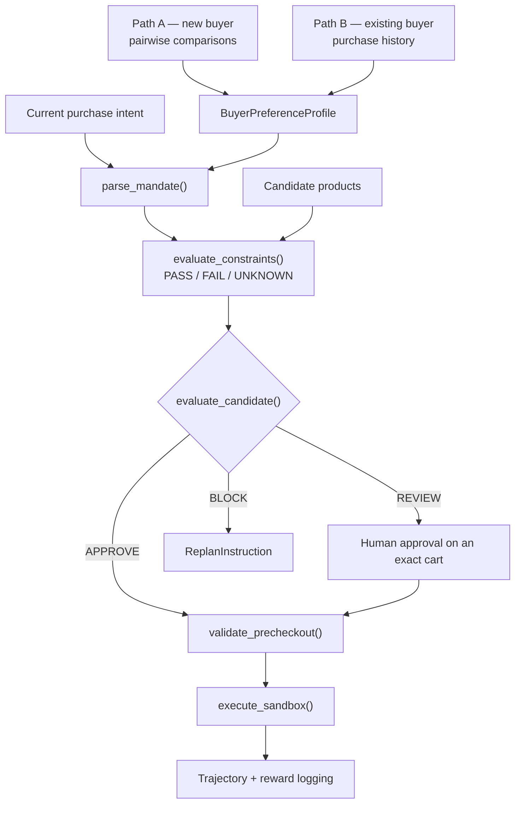

# MandateLab

**The buyer-alignment and authorization layer for agents that spend money.**

MandateLab learns what "best" means for an individual buyer, converts a purchase
request into an explicit mandate, and lets a commerce agent act only within it.
"Best deal" is not the cheapest product — it is the best buyer-specific
trade-off across price, quality, brand, delivery, condition, returns and
merchant trust.

Two responsibilities stay separate by design:

- **Commerce execution** — finding and attempting to buy a product.
- **Mandate authorization** — independently deciding whether that transaction is permissible.

The executor never bypasses the Decision Engine.

> Same products. Different buyer. Different best decision. Same mandate discipline.

Full spec: [`docs/mandatelab-mvp-prd.md`](docs/mandatelab-mvp-prd.md)

---

## What it does

A buyer arrives by one of two paths — swiping through product comparisons, or
handing over their purchase history. Both produce the same
`BuyerPreferenceProfile`. That profile plus a current request becomes an
explicit **mandate**: hard constraints, soft preferences, and spending
authority. Candidates are then checked against the mandate deterministically,
the final cart is revalidated immediately before checkout, and only an approved
cart can execute.



Preference precedence, highest first:

1. Current hard mandate
2. Current explicit preferences
3. Learned category preferences
4. General buyer preferences
5. Default assumptions

---

## Layout

```
contracts/        mandatelab_contracts  — shared schemas, the integration seam
mandate_engine/   mandatelab_engine     — mandates, constraints, decisions, pre-checkout
sandbox_executor/ mandatelab_sandbox_executor — guarded transaction execution
buyer_history/    buyer_history         — preference learning from purchase history
user_profile/     user_profile          — cold-start learning from pairwise comparisons
  frontend/       React + Vite comparison UI
docs/             the PRD
```

---

## Quick start

Python 3.11, [uv](https://docs.astral.sh/uv/) for the workspace.

```bash
uv sync
uv run pytest
```

Demos:

```bash
python3 buyer_history/examples/demo.py   # profile → prediction → update → trajectory
python3 user_profile/examples/demo.py    # Pareto set + ranked feed per buyer
```

`buyer_history` is stdlib-only, so it also runs with no install at all:

```bash
python3 buyer_history/tests/test_buyer_history.py   # 40 checks, no pytest needed
```

The comparison UI:

```bash
cd user_profile/frontend && npm install && npm run dev
```

---

## `contracts/` — the integration seam

Pydantic models every other module speaks: `BuyerPreferenceProfile`, `Mandate`,
`PurchaseIntent`, `TransactionCandidate`, `CartSnapshot`, `HumanApproval`,
`DecisionResult`, `ReplanInstruction`, plus the enums carrying decision
semantics — `Decision` (APPROVE / REVIEW / BLOCK), `ConstraintStatus`
(PASS / FAIL / UNKNOWN), `PreferenceSource`, `ImportanceLevel`.

`PreferenceProfileBuilder` is the protocol both learning paths implement, so
cold-start and history-derived profiles are interchangeable downstream:

```python
class PreferenceProfileBuilder(Protocol[ProfileInputT]):
    def build_profile(self, source: ProfileInputT, /) -> BuyerPreferenceProfile: ...
```

Every preference value carries a `source` and a `confidence`, so consumers can
tell a stated requirement from an inferred habit. `PreferenceSource`
distinguishes `CURRENT_EXPLICIT`, `COLD_START`, `CATEGORY_HISTORY`,
`GENERAL_HISTORY` and `DEFAULT`.

`HardRuleCandidate` carries a proposed hard rule — "never refurbished" — with
`requires_confirmation=True`, so a prohibition inferred during onboarding must
be confirmed before it can block a purchase.

---

## `mandate_engine/` — mandates, constraints, decisions

Deterministic code, never an LLM, decides policy compliance. Natural-language
extraction stays outside this boundary by design.

```python
from mandatelab_engine import (
    parse_mandate,          # (intent, profile) -> Mandate
    evaluate_constraints,   # (candidate, constraints) -> [ConstraintResult]
    is_feasible,            # all PASS?
    evaluate_candidate,     # (candidate, mandate) -> DecisionResult
    validate_precheckout,   # (cart, mandate, approval) -> DecisionResult
)
```

Each constraint returns PASS, **FAIL** or **UNKNOWN**, and a candidate joins the
feasible set only when all of them PASS — unverifiable data cannot slip through
as permission.

`evaluate_candidate` returns APPROVE, REVIEW or BLOCK with named reason codes
(`AUTONOMOUS_SPEND_LIMIT_EXCEEDED`, `FINAL_LANDED_PRICE_UNKNOWN`,
`MATERIAL_AMBIGUITY`, …). On BLOCK it emits a `ReplanInstruction` describing the
constraint to search under next.

`validate_precheckout` re-runs the decision against the final cart. Human
approval is bound to an exact cart snapshot, so a change to product, variant,
price, condition, merchant or delivery invalidates it and forces revalidation.

Details: [`mandate_engine/README.md`](mandate_engine/README.md)

---

## `sandbox_executor/` — guarded execution

The executor is a separate module from the Decision Engine, and it re-checks the
decision rather than trusting it.

```python
from mandatelab_sandbox_executor import execute_sandbox, InMemorySandboxExecutor

outcome = execute_sandbox(cart, decision)   # -> TransactionOutcome
```

Execution is refused, with a named code, when the decision is not APPROVE
(`DECISION_NOT_APPROVED`), still carries violations (`DECISION_HAS_VIOLATIONS`),
was issued for a different cart or candidate (`DECISION_CART_ID_MISMATCH`,
`DECISION_CART_FINGERPRINT_MISMATCH`, `DECISION_CANDIDATE_MISMATCH`), leaves a
REVIEW unresolved (`HUMAN_APPROVAL_UNRESOLVED`), has already run
(`CART_ALREADY_EXECUTED`), or is timestamped ahead of execution
(`DECISION_FROM_FUTURE`).

The cart fingerprint check is what makes approval non-transferable: an approval
granted for one cart cannot be replayed against a modified one.

---

## `buyer_history/` — learning from what the buyer already bought

Normalises multi-channel transaction history into one schema, filters lines that
are poor evidence of stable preference (subscriptions, media, one-off durables),
and infers per-item and per-category preferences weighted by both source
reliability and recency.

Purchase likelihood comes from an additive log-odds model with no fitted weight
vector, so every driver is named and explained:

```python
from buyer_history import build_profile_from_workbook, predict_purchase_probability
from buyer_history.contract import PurchaseHistoryProfileBuilder

bundle     = build_profile_from_workbook("…​.xlsx")
prediction = predict_purchase_probability(bundle, candidate, context)
print(prediction.explain())
#   P(buy) = 0.863 (confidence 0.45 / MEDIUM)
#     + item_affinity      +1.45  bought 4x, last on 2026-07-27
#     + brand_fit          +0.62  Lavazza accounts for 78% of this item's purchases
#     - price_fit          -0.09  +3% vs the $15.99 median; sensitivity here is HIGH

profile = PurchaseHistoryProfileBuilder("Groceries > Coffee").build_profile(bundle)
```

Price sensitivity and quality importance are scored **per category**, because a
single household number is wrong in both directions — the same buyer absorbs a
price rise on protein and retreats from one on coffee.

New purchases and feedback produce a new profile version; nothing is retrained.
Updates re-derive from the full ledger, so the same inputs always give the same
profile.

Two invariants: purchase history is **evidence, not ground truth** — current
explicit intent outranks it — and behaviour **never emits a hard mandate**.
`hard_rule_candidates` is always empty; only the cold-start path may propose
one. Attributes the data cannot speak to (condition, return policy, delivery)
are emitted as `UNKNOWN` at confidence 0, never as a guessed level.

Shopping missions are logged as trajectories — state, intent, candidates,
action, outcome, feedback, reward — so they can be replayed and rescored
offline.

`buyer_history.contract` is the only part needing Pydantic; it ships as an
opt-in extra and the core stays dependency-free.

Details: [`buyer_history/README.md`](buyer_history/README.md)

---

## `user_profile/` — cold start from pairwise comparisons

For buyers with no history. A React UI presents products exposing real
trade-offs — price vs quality, brand vs price, sustainability vs cost — and
records accept/reject responses.

`UserPreferenceModel` fits a Bayesian logistic model over product features and
their interactions (main effects, pairs and triples across category, brand,
price, quality and sustainability), giving calibrated weights and a decision
boundary that can be plotted back into the UI:

```python
from user_profile import load_products, UserPreferenceModel

model = UserPreferenceModel(load_products("user_profile/examples/products.csv"))
model.fit(observations)          # [(product, accepted), …]
model.buy_probability(product)
model.print_weights()
```

The package also carries the Pareto tooling — `ParetoCurve`, `filter_feed`,
`UtilityFunction` — for reducing a catalog to its non-dominated set before
ranking.

Catalog and buyer fixtures load from CSV, using the same product schema the
frontend parses:

```
id,name,category,brand,price,quality,sustainability
```

---

## Data and privacy

**This repository is public and contains no real purchase data.**

`buyer_history` runs on a synthetic fixture with an invented buyer, orders,
dates and prices. Real household data lives in a gitignored `transaction data/`
directory, and profiles derived from it are gitignored too — derived output
carries the same detail as its input.

Before adding any data source, confirm it is synthetic or gitignore it first.
